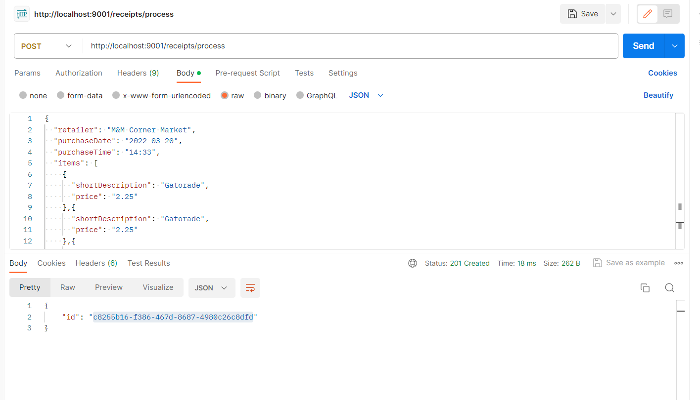
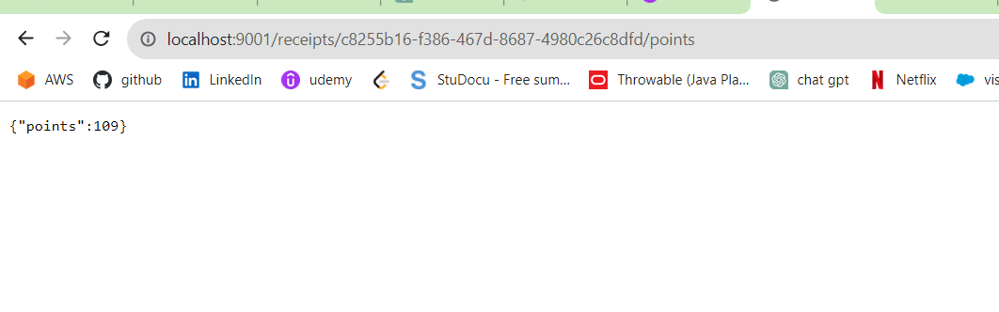

"# Backend_Fetch" 

To run the application Please follow the below steps.
I am using Windows machine, I recommand to test it on windows

1. First the docker should be installed and running in the local machine
Docker can be installed using this link https://www.docker.com/products/docker-desktop

2. Once Docker is running on your local machine, clone this repository
3. Once entered into the file directory in your local machine use the following command to build docker image
Command: docker build -t node-backend-fetch .
4. Once the docker image built, create a docker container by running the below command
Command: docker run -it -p 9001:4500 node-backend-fetch

5. Once it is running on port 4500 but the docker runs on port 9001

Install Postman
6. Open postman -> Method POST -> Url http://localhost:9001/receipts/process
In the body -> raw -> set to JSON add the JSON data
Below image is an example using postman

Once the JSON data is added to the raw. send the request
It generates id
Example: 
{
    "id": "c8255b16-f386-467d-8687-4980c26c8dfd"
}

copy the id -> open the browser chrome -> hit the url http://localhost:9001/receipts/{id}/points
Example:
http://localhost:9001/receipts/c8255b16-f386-467d-8687-4980c26c8dfd/points

Sample result example screenshot:
